[](https://discord.gg/SWg6vgcw3F)

# Yet Another Behavior Tree

A Behavior Tree implementation for [Godot Engine](https://godotengine.org/)

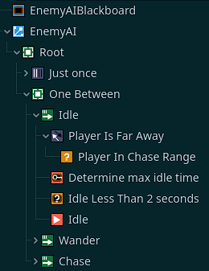

## 📄 Yet Another Behavior Tree in a nutshell

This behavior tree is a Godot node that can be added to your *Scene* tree. The logic inside tree nodes will be run every frame, during *process* or *physics process*, depending on tree process mode.

At each frame, the `tick` function of tree nodes will be run. This function has access to the *actor* (the node the tree is describing behavior for), and a *blackboard* (allowing to share data between nodes). The tick function can either returns:
- *SUCCESS*, indicating that node execution is successful,
- *RUNNING*, indicating that node is doing a long computation/action/whatever you want, that is not finished yet,
- *FAILURE*, indicating that something went wrong during child execution (condition not met, ...).

Depending on your tree structure, node result will produce various behaviors. See node documentation for mor details.

## 📄 Features

➡️ This plugin is an implementation of well-known Behavior Trees, allowing game developers to create AI-Like behaviors for their NPCs. In addition to provide all behavior tree base nodes, this plugin also brings additional helper nodes that avoid to create custom ones.

➡️ As all behavior trees, this implementation provides a tree root called `BTRoot`. This node will contains all your AI logic. Root node only accept a unique behavior tree node as child, which is a composite node. Composite nodes defines the root of a tree branch : each branch can be seen as a *rule* for your AI. They accept any kind of behavior tree nodes as children. It can either be a composite, decorator or leaf nodes. Decorator nodes allow to customize result of its only child node. Leaf nodes, as their name implies, do not have any child. They represents basic unit of work of your AI, which can be separated into two notions: conditions and actions.

➡️ In some cases, you will need to share information between your AI nodes. To avoid to create side scripts and/or stateful entities, this behavior tree also provides the notion of Blackboard. In a blackboard, you can store key-value datas. They can be retrieve and updated from any node in your tree. Blackboard is not erased between tree execution, meaning you can store persistent datas in it.

➡️ Once in a while, it is useful to disable a tree node, to prevent it's behavior. A simple way to do that is to remove the tree node from the tree itself ; but if you want to reactivate the tree bahavior, you will need to re-add the tree node in the tree. That's not user-friendly. To avoid that situation, it is possible to disable a node by setting its `process_modde` property (*built-in Godot*) to `PROCESS_MODE_DISABLED`. Note that disablAsed nodes are checked by *composite nodes* only, meaning it's the composite node that will not *tick* its child node if its `process_mode` is disabled. As a consequence, disabling a *decorator* child node has no effect, instead the decorator itself must be disabled.

*(See below for full node documentation)*

➡️ Having nice features is cool, but beeing able to use them in an easy way is cooler 😎. **Yet Another Behavior Tree** provides a nice Godot Editor integration throught
- A set on uniform and beautiful (😂) node icons, that make it easier to identify what each node is and what it is doing in the *Scene* view,
- Configuration warning in *Scene* view if your behavior tree is not well configured,
- Easy node configuration through exported variables

## 📄 Nodes Documentation

###  BTBlackboard

Blackboard allows to share data across nodes and behavior trees. You can create/retrieve/erase pairs of key-value. Keys and values are variants and can be anything.

Data in blackboard can be isolated in so-called *namespaces*. A data key can exists only once in a namespace, but can exists multiple times across namespaces, allowing the user to isolate data when, for example, a blackboard is shared between multiple behavior trees. By default, if no namespace is specified when inserting a data into a blackboard, the *default namespace* is used.

Some well-known properties are already fed by the root tree during execution :
- `delta` : the float value of delta from *process* or *physics process* (depending on root tree process mode).

A blackboard can also be reset using `reset` method. This method will erase all blackboard content, except well-known properties. The initial data is also restored after resetting the blackboard.

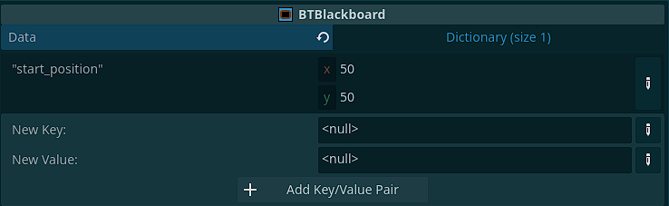

🔑 Properties list:
- `data` : a dictionnary allowing to specifies default entries before tree first execution. Those entries are added in the default namespace of the blackboard. If you want to add default entries in another namespace, you must do it in a script.

###   BTRoot

Its the entry point of your behavior tree. It can only have a unique child of type `BTComposite`.

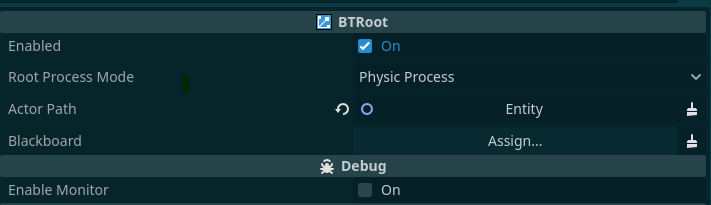

🔑 Properties list:
- `enabled` : indicates if tree should run or not. Default is *on*,
- `root_process_mode` : indicates whether tree should execute during *process* or *physics process*. Default is *physics process*,
- `actor_path` : path to the node that the tree is drescribing actions for. This is the node that will be passed to all tree nodes, allowing you to manipulate the actor at every tree step. Default is *empty*.
- `blackboard` : path to the blackboard node. This allows to share a same blackboard between several trees, for example to code a group of enemies acting together, or to specify some default entries using the editor. If empty, a default empty blackboard will be used during tree execution. Default is *empty*,
- `enable_monitor` (*debug option*) : indicates if, in debug mode, a custom monitor should be created for this tree. Custom monitor allows to track performances in Debugger Monitors view.

`BTRoot` can be reset, allowinf to resuse the node for another usage. Resetting the tree ensures that all its nodes will be reset too (recursively). Resetting the tree does *not* reset the associated blackboard, since blackboards can be shared among multiple trees. To reset the blackboard, use its reset function.

###   BTSelector

The selector node is a *composite node* that executes its children from the first one to the last one, in order, until one of them returns *SUCCESS*. If a selector child succeeds, the selector succeed too. If all selector children failed, the selector fails too.

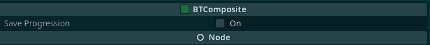

🔑 Properties list:
- `save_progression` : indicates whether the selector should resume to the last running child on next tree execution (*on*), or restart from its first child (*off*). Its usefull to describe a non-interruptible action, or to optimize process time. Default is *off*.

###   BTRandomSelector

The random selector node is a *composite node* that behaves like the `BTSelector` node, except that it executes its children in random order.

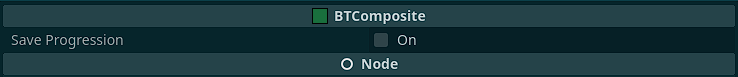

🔑 Properties list:
- `save_progression` : indicates whether the random selector should resume to the last running child on next tree execution (*on*), or restart from its first child (*off*). Its usefull to describe a non-interruptible action, or to optimize process time. Default is *off*.

###   BTSequence

The sequence node is a *composite node* that executes its children from the first one to the last one, until all children succeed or one of its children fails. If all children succeed, the sequence succeeds too ; if one child fails, the sequence fails too.


🔑 Properties list:
- `save_progression` : indicates whether the sequence should resume to the last running child on next tree execution (*on*), or restart from its first child (*off*). Its usefull to describe a non-interruptible action, or to optimize process time. Default is *off*.

###   BTParallel

The parallel node is a *composite node* that executes all its children at each `tick`. If at least one child is is running, the parallel reports it's running too. If no child is running, then if at least one child succeeded, the parallel reports success, else it reports failure.

###  BTSuccess

The success node is a *decorator* node that always returns *success* on child execution.

###  BTFailure

The failure node is a *decorator* node that always returns *failed* on child execution.

###  BTInverter

The inverter node is a *decorator* node returns *success* when its child fails its execution, and *failure* when its child succeeds its execution. When its child is *running*, it returns *running* too.

###  BTLimiter

The limiter node is a *decorator* node that limits the total number of execution of its child node. When the limit is not reachs, the limiter nodes reports its child execution status. Once the limit is reachs, it never executs its child and always report a *failed* execution.

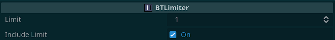

🔑 Properties list:
- `limit`: number of allowed child execution. Default is *1*,
- `include_limit`: whether or not the `limit` value is included into the number of times the child can run. It clarifies the usage of the limit. Default is *on*.

###  BTRepeatUntil

The repeat until node is a *decorator* node that loop its child execution until child execution result is as excepted. It is possible to specifies the maximum number of loop execution allowed to obtain the desired result. If desired result is obtained before the loop execution limit, the repeat until node returns the obtained result. If not, its returns a *failure*.

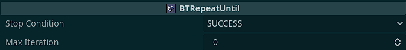

🔑 Properties list:
- `stop_condition`: expected child result to stop the loop. Default is *SUCCESS*,
- `max_iteration`: maximum number of child execution to obtain the desired result. If value is *0*, there is **no limit** to the number of times the loop can run (⚠️ be careful to not create an infinite loop). If value is more than zero, its represents the maximum number of loop execution. Default is *0*.

###  BTRandom

The random node is a *decorator* node randomly execute its child. If the child is executed, the node result is the same as its child result. Otherwise, result is *failure*.

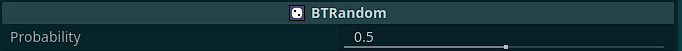

🔑 Properties list:
- `probability`: a float between *0* (included) and *1* (included) indicating the probability of child execution. Default is *0.5*.

###  BTCondition

The condition node is a *leaf* node. Its purpose is to return *success* when  a condition is meet, *failure* otherwise. This node should never return *running*.

**Users must subclass this node to implements their own condititions**.

###  BTConditionCallable

The callable condition node is a *leaf* node. The node calls a function from an object that has been parametrized to check for a condition. It can also pass arguments to this function. Its result is the function result, meaning that specified function must returns a `bool` value. This nodes returns *success* if function call returned `true`, and *failure* if function call returned `false`.

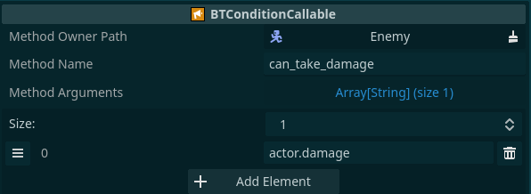

🔑 Properties list:
- `method_owner_path`: path to the node that contains the function to call. Default is *empty*,
- `method_name` : name of the function to call in the *method owner node*. Default is *empty*,
- `method_arguments`: array of arguments to pass when calling the function. Arguments are expressions that will be evaluated by Godot Engine at runtime to produce the desired value. See [Godot Expression](https://docs.godotengine.org/en/latest/classes/class_expression.html) for details. In expression, user has access to two predefined variables:
  - `actor`: the node the tree is describing action for,
  - `blackboard`: the tree blackboard,
  - `delta`: the *_process* or *_physics_process* delta value, as a `float`.
Number and types of arguments must match function prototype, or an error will occurs at runtime. Default is an *empty array* meaning no argument.

###  BTConditionBlackboardKeyExists

The blackboard key exists condition node is a *leaf* node. It returns *success* if a certain key is present in the tree blackboard during its execution, *failure* otherwise. This node operates in the blackboard *default namespace*.

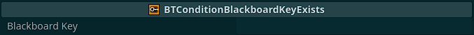

🔑 Properties list:
- `blackboard_key`: name of the key that must exists in the blackboard, in *default namespace*.

⚠️ Due to GDScript 2.0 restrictions, only string type keys can be set, since its not possible to export Variant variables.

###  BTConditionBlackboardValuesComparison

The blackboard values comparison condition node is a *leaf* node. It returns *success* both values represented by specified keys returns true when compared using the given operator. This node operates in the blackboard *default namespace*.

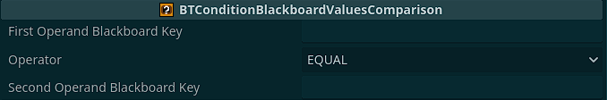

🔑 Properties list:
- `first_operand_blackboard_key`: name of the key that old the first value to compare, in *default namespace*,
- `operator` : operator used to compare values,
- `second_operand_blackboard_key`: name of the key that old the second value to compare, in *default namespace*.

⚠️ Due to GDScript 2.0 restrictions, only string type keys can be set, since its not possible to export Variant variables.

###  BTAction

The action node is a *leaf* node. Its purpose is to return *success* when an action is completed, *failure* if its fails to execute, and *running* if the action is occuring but is not completed yet.

**Users must subclass this node to implements their own actions**.

###  BTActionCallable

The callable action node is a *leaf* node. At each tick, the node calls a function from an object that has been parametrized. It can also pass arguments to this function. Its result depends of the specified function result:
- If specified function returns a `bool`, then the tick result is *success* is boolean is true, *failure* otherwise,
- If the specified function returns an `int`, it is interpreted as the enum values `SUCCESS`, `RUNNING` or `FAILURE` from `BTTickResult` object. If another value is returned by specified function, behavior is undefined,
- If specified function returns nothing (`void` or `null` result), then *success* is returned.

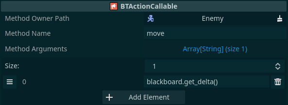

🔑 Properties list:
- `method_owner_path`: path to the node that contains the function to call. Default is *empty*,
- `method_name` : name of the function to call in the *method owner node*. Default is *empty*,
- `method_arguments`: array of arguments to pass when calling the function. Arguments are expressions that will be evaluated by Godot Engine at runtime to produce the desired value. See [Godot Expression](https://docs.godotengine.org/en/latest/classes/class_expression.html) for details. In expression, user has access to two predefined variables:
  - `actor`: the node the tree is describing action for,
  - `blackboard`: the tree blackboard,
  - `delta`: the *_process* or *_physics_process* delta value, as a `float`.
Number and types of arguments must match function prototype, or an error will occurs at runtime. Default is an *empty array* meaning no argument.


###  BTActionWait

The wait action node is a *leaf* node. Its execution returns *running* during the specified wait time, then returns *success* when specified time is elapsed. After succeeded, the wait time is rearmed for next tree execution.

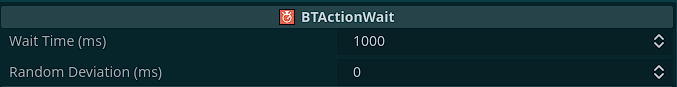

🔑 Properties list:
- `wait_time_ms`: number of milliseconds to wait before returning *success*. Default is *1000*,
- `random_deviation_ms` : indicates if a random deviation should be applied to the wait time. *0* means there is no deviation et the wait time will be strictyl respected. Random deviation may change after each node rearm. Default is *0*, meaning no deviation at all.

###  BTActionBlackboardSet

The blackboard set action node is a *leaf* node. It allows to set a value in the blackboard. Its execution always returns *success*. This node operates in the blackboard *default namespace*.

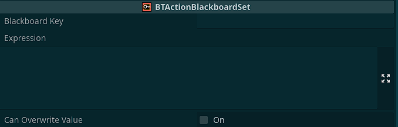

🔑 Properties list:
- `blackboard_key`: name of the key that must be set, in *default namespace*,
- `expression` : an expression representing the value to associated to the given key. The expression will be evaluated by Godot Engine during child execution. It should be simple. See [Godot Expression](https://docs.godotengine.org/en/latest/classes/class_expression.html) for details. In expression, user has access to two predefined variables:
  - `actor`: the node the tree is describing action for,
  - `blackboard`: the tree blackboard,
  - `delta`: the *_process* or *_physics_process* delta value, as a `float`.
- `can_overwrite_value` : a boolean indicating if the value must be overwritten if it already exists or not.

⚠️ Due to GDScript 2.0 restrictions, only string type keys can be set, since its not possible to export Variant variables.

###  BTActionBlackboardDelete

The blackboard delete action node is a *leaf* node. It allows to erase a key from the tree blackboard. This node operates in the blackboard *default namespace*.

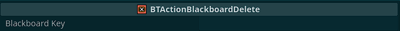

🔑 Properties list:
- `blackboard_key`: name of the key that must be erased from blackboard, in *default namespace*.

⚠️ Due to GDScript 2.0 restrictions, only string type keys can be set, since its not possible to export Variant variables.

## 📄 Creating your own nodes

Even if the provided node set is wonderful and all (😁), you will need to create your own nodes to describe your own behavior, your functional actions and conditions, or whatever you want. 

*Creating your own composite and decorator nodes is off-topic here, and should be reserved for advanced users.* But creating your own actions and conditions is required, and is quite simple. 

Empty-shell nodes **BTAction** and **BTCondition** are your entry-points. You just need to create a GDScript that extends one of this node, depending on what you want to do, and overrick the `tick` function, then code your functional stuff in it !

### Exemple of condition

```gdscript
@icon("res://addons/yet_another_behavior_tree/src/Assets/Icons/btcondition.png")
class_name ConditionPlayerIsInRange
extends BTCondition

@export var player_detection_distance:int = 50

func tick(actor:Node, _blackboard:BTBlackboard) -> int:
    var player_position:Vector2 = get_tree().get_nodes_in_group("player")[0].global_position
    var actor_position:Vector2 = actor.global_position
    var player_distance:float = actor_position.distance_to(player_position)

    if player_distance <= player_detection_distance:
        return BTTickResult.SUCCESS

    return BTTickResult.FAILURE

```

### Exemple of action

```gdscript
@icon("res://addons/yet_another_behavior_tree/src/Assets/Icons/btaction.png")
class_name ActionWander
extends BTAction

func tick(actor:Node, blackboard:BTBlackboard) -> int:
    var current_position:Vector2 = actor.global_position
    var target_position:Vector2 = blackboard.get_data("wander_position")
    if current_position.distance_to(target_position) < 5:
        return BTTickResult.SUCCESS
    else:
        var direction:Vector2 = (target_position - current_position).normalized()
        actor.velocity = direction
        return BTTickResult.RUNNING

```
